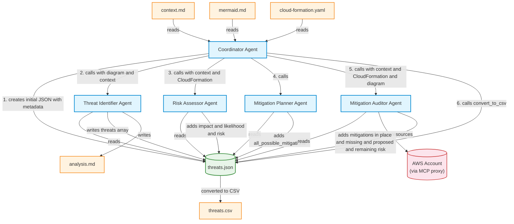

# Workflow Diagram



## Key Design Principles

1. **JSON as shared data format** — `threats.json` is the single source of truth, passed between agents via filesystem
2. **Workers read/write directly** — each agent has filesystem MCP access to read `threats.json`, add its fields, and write it back
3. **Additive only** — each agent adds new fields without modifying existing ones
4. **No null placeholders** — agents only write the fields they're responsible for
5. **CSV generated at the end** — a Python `convert_to_csv` tool converts the final JSON to pipe-delimited CSV

## Agent Responsibilities

| Agent | Reads | Adds to threats.json |
|-------|-------|---------------------|
| Coordinator | context.md, mermaid.md, cloud-formation.yaml | metadata (date, service name) |
| Threat Identifier | threats.json | stride_category, element, threat, attack_method |
| Risk Assessor | threats.json | impact, likelihood, risk |
| Mitigation Planner | threats.json | all_possible_mitigations (array) |
| Mitigation Auditor | threats.json + AWS | mitigations_already_in_place, mitigations_missing, ai_proposed_mitigations, remaining_risk |

## JSON Format

```json
{
  "metadata": {
    "date_of_analysis": "2026-06-16",
    "service_project": "Smarter Tariff - Small Asset Owner Services"
  },
  "threats": [
    {
      "stride_category": "Spoofing",
      "element": "API Gateway",
      "threat": "[threat in grammar format]",
      "attack_method": "description of how the attack works",
      "impact": "High",
      "likelihood": "Medium",
      "risk": "High",
      "all_possible_mitigations": ["mitigation 1", "mitigation 2"],
      "mitigations_already_in_place": ["mitigation 1"],
      "mitigations_missing": ["mitigation 2"],
      "ai_proposed_mitigations": ["mitigation 2 — reason for priority"],
      "remaining_risk": "Medium"
    }
  ]
}
```
