# Workflow Diagram

```mermaid
flowchart TD
    %% Input files
    context["context.md"]
    mermaid["mermaid.md"]
    cf["cloud-formation.yaml"]

    %% Shared data file
    threats_json[("outputs/threats.json")]

    %% Agents
    coordinator["Coordinator Agent"]
    threat_id["Threat Identifier Agent"]
    risk["Risk Assessor Agent"]
    planner["Mitigation Planner Agent"]
    auditor["Mitigation Auditor Agent"]

    %% Validators
    v1{{"validate_after_threat_identifier"}}
    v2{{"validate_after_risk_assessor"}}
    v3{{"validate_after_mitigation_planner"}}
    v4{{"validate_after_mitigation_auditor"}}

    %% Output files
    analysis["outputs/analysis.md"]
    threats_csv["outputs/threats.csv"]

    %% External
    aws[("AWS Account\n(via MCP proxy)")]

    %% Step 1-3: Coordinator reads input files
    context -->|"reads"| coordinator
    mermaid -->|"reads"| coordinator
    cf -->|"reads"| coordinator

    %% Step 4: Coordinator creates initial threats.json
    coordinator -->|"1. creates initial JSON with metadata"| threats_json

    %% Step 5: Threat Identifier + Validation
    coordinator -->|"2. calls with diagram and context"| threat_id
    threat_id -->|"reads"| threats_json
    threat_id -->|"writes threats array"| threats_json
    threat_id -->|"writes"| analysis
    threats_json -->|"check"| v1
    v1 -->|"✗ retry with errors"| threat_id
    v1 -->|"✓ pass"| coordinator

    %% Step 6: Risk Assessor + Validation
    coordinator -->|"3. calls with context and CloudFormation"| risk
    risk -->|"reads"| threats_json
    risk -->|"adds impact, likelihood, risk"| threats_json
    threats_json -->|"check"| v2
    v2 -->|"✗ retry with errors"| risk
    v2 -->|"✓ pass"| coordinator

    %% Step 7: Mitigation Planner + Validation
    coordinator -->|"4. calls"| planner
    planner -->|"reads"| threats_json
    planner -->|"adds all_possible_mitigations"| threats_json
    threats_json -->|"check"| v3
    v3 -->|"✗ retry with errors"| planner
    v3 -->|"✓ pass"| coordinator

    %% Step 8: Mitigation Auditor + Validation
    coordinator -->|"5. calls with context, CloudFormation, diagram"| auditor
    auditor -->|"reads"| threats_json
    auditor -->|"queries live resources"| aws
    auditor -->|"adds mitigations in place, missing, proposed, remaining risk"| threats_json
    threats_json -->|"check"| v4
    v4 -->|"✗ retry with errors"| auditor
    v4 -->|"✓ pass"| coordinator

    %% Step 9: Convert to CSV
    coordinator -->|"6. calls convert_to_csv"| threats_json
    threats_json -->|"converted to CSV"| threats_csv

    %% Styling
    classDef agent fill:#e1f5fe,stroke:#0288d1,stroke-width:2px
    classDef file fill:#fff3e0,stroke:#f57c00,stroke-width:1.5px
    classDef data fill:#e8f5e9,stroke:#388e3c,stroke-width:2px
    classDef external fill:#fce4ec,stroke:#c62828,stroke-width:1.5px
    classDef validator fill:#f3e5f5,stroke:#7b1fa2,stroke-width:1.5px

    class coordinator,threat_id,risk,planner,auditor agent
    class context,mermaid,cf,analysis,threats_csv file
    class threats_json data
    class aws external
    class v1,v2,v3,v4 validator
```



## Key Design Principles

1. **JSON as shared data format** — `outputs/threats.json` is the single source of truth, passed between agents via filesystem
2. **Workers read/write directly** — each agent has filesystem MCP access to read `outputs/threats.json`, add its fields, and write it back
3. **Additive only** — each agent adds new fields without modifying existing ones
4. **Sequential execution** — `parallel_tool_calls=False` on the coordinator ensures agents run one at a time
5. **Programmatic validation with retry** — after each agent writes, a Python validator checks the output; on failure the agent is re-invoked with the specific errors (up to 2 retries)
6. **CSV generated at the end** — a Python `convert_to_csv` tool converts the final JSON to pipe-delimited CSV

## Validation Logic

Each agent has a corresponding validator in `validation/validators.py`:

| Validator | What it checks |
|-----------|---------------|
| `validate_after_threat_identifier` | Non-empty threats array, all 4 fields present and non-null, valid STRIDE categories |
| `validate_after_risk_assessor` | Threat count preserved, impact/likelihood/risk non-null, risk matches the defined matrix (Impact × Likelihood → Risk) |
| `validate_after_mitigation_planner` | Threat count preserved, all_possible_mitigations is a non-empty array of strings |
| `validate_after_mitigation_auditor` | Threat count preserved, mitigations_already_in_place + mitigations_missing count equals all_possible_mitigations count, remaining_risk is valid |

On failure, the validator returns a string of specific errors which is appended to the agent's input for the retry attempt.

## Agent Responsibilities

| Agent | Reads | Adds to threats.json |
|-------|-------|---------------------|
| Coordinator | context.md, mermaid.md, cloud-formation.yaml | metadata (date, service name) |
| Threat Identifier | outputs/threats.json | stride_category, element, threat, attack_method |
| Risk Assessor | outputs/threats.json | impact, likelihood, risk |
| Mitigation Planner | outputs/threats.json | all_possible_mitigations (array) |
| Mitigation Auditor | outputs/threats.json + AWS | mitigations_already_in_place, mitigations_missing, ai_proposed_mitigations, remaining_risk |

## JSON Format

```json
{
  "metadata": {
    "date_of_analysis": "2026-06-16",
    "service_project": "Smarter Tariff - Small Asset Owner Services"
  },
  "threats": [
    {
      "stride_category": "Spoofing",
      "element": "API Gateway",
      "threat": "[threat in grammar format]",
      "attack_method": "description of how the attack works",
      "impact": "High",
      "likelihood": "Medium",
      "risk": "High",
      "all_possible_mitigations": ["mitigation 1", "mitigation 2"],
      "mitigations_already_in_place": ["mitigation 1"],
      "mitigations_missing": ["mitigation 2"],
      "ai_proposed_mitigations": ["mitigation 2 — reason for priority"],
      "remaining_risk": "Medium"
    }
  ]
}
```
