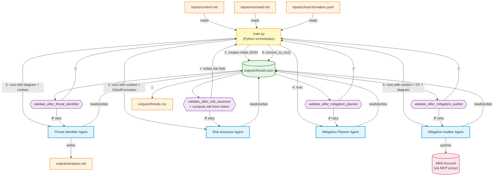

# Workflow Diagram

## Key Differences from Project 3

- **No coordinator agent** — Python orchestrates directly (cheaper, faster, no parallel execution bugs)
- **Risk calculated in code** — agent only assesses impact + likelihood; risk is derived from the matrix deterministically
- **Single entry point** — `main.py` is both the CLI and the workflow

## Validation Logic

| Validator | What it checks |
|-----------|---------------|
| `validate_after_threat_identifier` | Non-empty threats array, all 4 fields present, valid STRIDE categories |
| `validate_after_risk_assessor` | Impact/likelihood valid + **computes risk from matrix and writes it** |
| `validate_after_mitigation_planner` | all_possible_mitigations is array of 1-10 strings per threat |
| `validate_after_mitigation_auditor` | in_place + missing = all_possible, remaining_risk valid |

## Agent Responsibilities

| Agent | Input | Adds to threats.json |
|-------|-------|---------------------|
| Threat Identifier | diagram + context | stride_category, element, threat, attack_method |
| Risk Assessor | context + CloudFormation | impact, likelihood |
| Mitigation Planner | (reads threats.json) | all_possible_mitigations |
| Mitigation Auditor | context + CF + diagram + AWS | mitigations_already_in_place, mitigations_missing, ai_proposed_mitigations, remaining_risk |

Note: `risk` is computed by the validator, not the agent.
