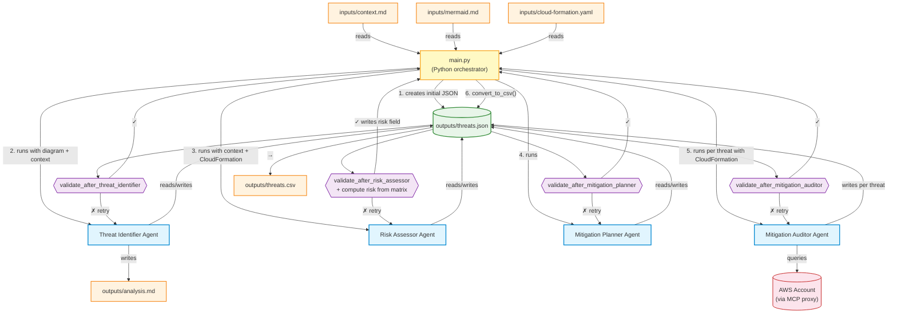

# Workflow Diagram



## Code Structure

```
main.py                          CLI entry point AND pipeline orchestrator — validates env, cleans outputs, runs workflow
constants.py                     MODEL, MAX_RETRIES, FILESYSTEM_MCP_PARAMS, AWS_MCP_PARAMS
workflow_agent_prompts/
  threat_identifier.py           STRIDE threat identification instructions
  risk_assessor.py               Impact/likelihood assessment instructions
  mitigation_planner.py          Mitigation proposal instructions
  mitigation_auditor.py          AWS audit instructions (includes hard constraint on unsupported services)
workflow_steps/
  threat_identification.py       Step 1 — creates agent, builds input message, calls run_agent_with_validation
  risk_assessment.py             Step 2 — creates agent, builds input message, calls run_agent_with_validation
  mitigation_planning.py         Step 3 — creates agent, calls run_agent_with_validation (no input message)
  mitigation_auditing.py         Step 4 — loops per threat; each threat gets a fresh agent + internal retry
utils/
  agent_run.py                   run_agent_with_validation() — streams agent, validates output, retries
  agent_factory.py               create_client(), create_agent() — builds OpenAI client and Agent instances
  setup_commands.py              validate_environment(), clean_outputs(), read_input(), create_initial_threats_json()
  get_trace.py                   FileSpanExporter — writes trace spans to a local JSON file
  parsers.py                     extract_service_name() — parses service name from context
  from_json_to_csv_converter.py  convert_to_csv_from_file() — reads threats.json, writes pipe-delimited threats.csv
validation/validators.py         Four validators — one per pipeline step; risk_assessor also writes risk field
tests/unit/                      Unit tests — 100% line coverage, no LLM calls
workflow_agent_tests/            Integration tests — run individual agents end-to-end (require API access)
```

## Validation Logic

| Validator | What it checks |
|-----------|---------------|
| `validate_after_threat_identifier` | Non-empty threats array, all 4 fields present, valid STRIDE categories |
| `validate_after_risk_assessor` | Impact/likelihood valid + **computes risk from matrix and writes it** |
| `validate_after_mitigation_planner` | all_possible_mitigations is array of 1-10 strings per threat |
| `validate_after_mitigation_auditor` | in_place + missing = all_possible, remaining_risk valid |

## Agent Responsibilities

| Agent | Input | Adds to threats.json |
|-------|-------|---------------------|
| Threat Identifier | diagram + context | stride_category, element, threat, attack_method |
| Risk Assessor | context + CloudFormation | impact, likelihood |
| Mitigation Planner | (reads threats.json directly) | all_possible_mitigations |
| Mitigation Auditor | CloudFormation + live AWS | mitigations_already_in_place, mitigations_missing, ai_proposed_mitigations, remaining_risk |

Note: `risk` is computed by the validator from the risk matrix, not by the agent.

## Agent Details

### Threat Identifier

**MCP server:** Filesystem MCP (`@modelcontextprotocol/server-filesystem`) — grants read/write access to the project directory.

**What it receives:** The architecture diagram (`inputs/mermaid.md`) and business context (`inputs/context.md`) are read by `main.py` and injected into the agent's input message. Today's date is also included.

**What it analyses:** All components visible in the architecture diagram. Applies each STRIDE category (Spoofing, Tampering, Repudiation, Information Disclosure, Denial of Service, Elevation of Privilege) to each component. Aims for up to 30 threats. Uses structured analysis steps: assets, entry points, trust boundaries, attacker profiles.

**How it works:** Runs in one go — reads `outputs/threats.json` once via the filesystem MCP, populates the full `threats` array, and writes the entire file back in a single operation.

**Output:** Writes two files:
- `outputs/threats.json` — threats array with `stride_category`, `element`, `threat` (in threat grammar format), `attack_method`; all other fields set to `null`
- `outputs/analysis.md` — structured analysis document (assets, entry points, trust levels, attacker profiles)

**Model:** `openai/gpt-4o-mini`

---

### Risk Assessor

**MCP server:** Filesystem MCP — grants read/write access to the project directory.

**What it receives:** Business context and CloudFormation resource definitions are injected into the input message by `main.py`. It does NOT receive the architecture diagram.

**What it analyses:** Each threat already in `threats.json`. Assesses:
- **Impact** (Low/Medium/High): damage if realised — data sensitivity, compliance implications, business criticality
- **Likelihood** (Low/Medium/High): probability of occurrence — attack surface, existing controls visible in CloudFormation, attacker capability

**How it works:** Runs in one go — reads `outputs/threats.json` once via the filesystem MCP, adds `impact` and `likelihood` to every threat, and writes the entire file back in a single operation. It does NOT calculate `risk` — that is computed deterministically from the risk matrix by the validator after the agent finishes.

**Output:** Updated `outputs/threats.json` with `impact` and `likelihood` added to each threat.

**Model:** `openai/gpt-4o-mini`

---

### Mitigation Planner

**MCP server:** Filesystem MCP — grants read/write access to the project directory.

**What it receives:** No input message is passed — the agent's only instruction is its system prompt. It reads everything it needs from `outputs/threats.json` directly via the filesystem MCP.

**What it analyses:** Every threat in `outputs/threats.json`. For each, identifies the most relevant mitigations across four categories: Preventive, Detective, Corrective, and Compensating.

**How it works:** Runs in one go — reads `outputs/threats.json` once, adds `all_possible_mitigations` to every threat (4-8 items, max 10), and writes the entire file back in a single operation.

**Output:** Updated `outputs/threats.json` with `all_possible_mitigations` (array of strings) added to each threat.

**Model:** `openai/gpt-4o-mini`

---

### Mitigation Auditor

**MCP server:** AWS MCP (`mcp-proxy-for-aws`) — exposes a single `aws___call_aws` tool that executes raw AWS CLI commands against a live AWS account. No filesystem access.

**What it receives:** The orchestrator (`run_mitigation_audit`) reads `threats.json` in Python and loops over threats. For each threat, a new agent instance is created and receives: the single threat object (JSON), the AWS account ID and region, and the CloudFormation resource definitions. Context and diagram are NOT passed.

**What it analyses:** ONE THREAT AT A TIME. For each threat it queries live AWS infrastructure to verify which mitigations from `all_possible_mitigations` are actually in place. AWS queries are limited to supported services (ec2, iam, lambda, s3, kms, etc. — see hard constraint in prompt). Starts with `aws sts get-caller-identity` to warm up the connection; makes at most 5-6 calls per threat.

**How it works:** Per-threat loop — for each threat: spawns a fresh agent, runs up to 3 internal retry attempts (`_execute_threat_audit_attempt`), and writes the result to `threats.json` immediately after that threat completes. This means `threats.json` is updated incrementally, one threat at a time, so a partial run can be resumed.

**Structured output:** The agent uses the OpenAI Agents SDK structured output feature — its `output_type` is set to the `ThreatAuditResult` Pydantic model. The agent is forced to return a validated JSON object matching that schema rather than free text. Python then reads the typed result directly (no parsing) and writes the fields into `threats.json` itself — the agent never touches the file.

**Output:** Adds to each threat in `outputs/threats.json`:
- `mitigations_already_in_place` — mitigations confirmed via AWS or CloudFormation
- `mitigations_missing` — mitigations not found in live AWS or CloudFormation
- `ai_proposed_mitigations` — highest-priority missing items with remediation notes
- `remaining_risk` — residual risk level (Critical/High/Medium/Low) after accounting for what is in place

**Model:** `openai/gpt-4.1-mini` — a different model from the other three agents. The auditor receives a much larger context per invocation: the full threat object, the entire CloudFormation template, and the accumulated AWS CLI responses. `gpt-4.1-mini` has a 1M-token context window, which is necessary to handle this volume without truncation. The default model (`gpt-4o-mini`) has a 128K context window, which is insufficient when CloudFormation is large.
